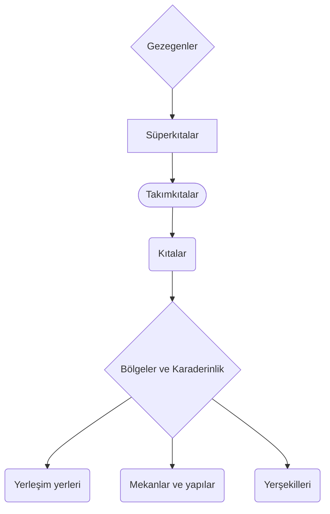
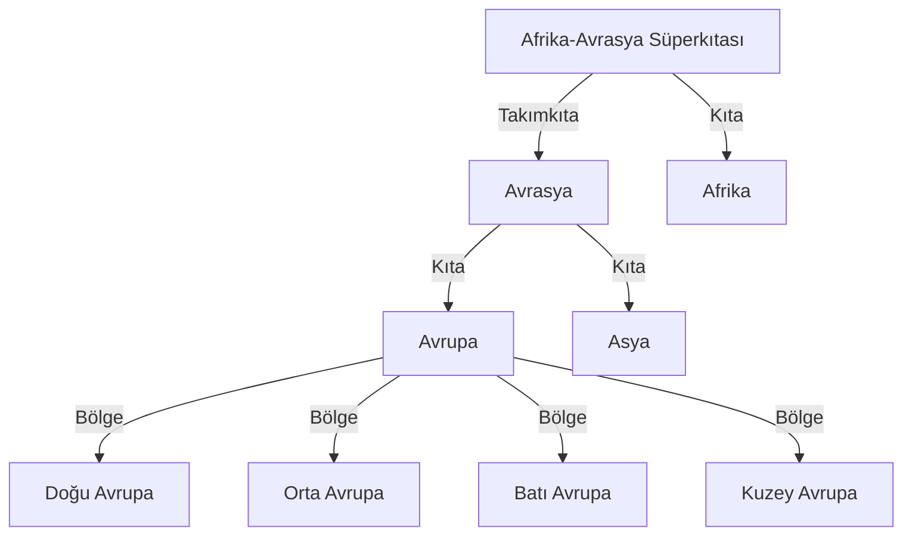
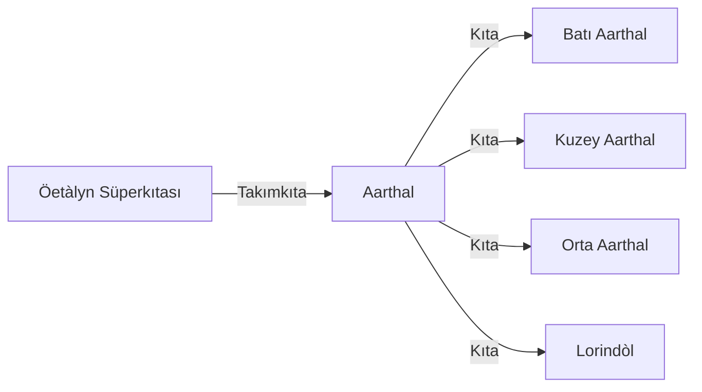

# Bölüm I: Coğrafya nedir, neden kendine ait bir sayfası var?
> Coğrafya; beşerî (insanî) sistemleri ve yeryüzünü araştıran, bunlar arasındaki ilişkiyi neden-sonuç ve dağılış ilkesine bağlı olarak inceleyen ve sorgulayan bir bilim dalıdır. Yer ve insanlar arasındaki ilişkiler coğrafyanın konusunu oluşturur.
   -Vikipedi(Coğrafya)

**Aarthal evreni**(süperkıta olan Aarthal'dan farklı olarak oyun evreninin tamamına denmiştir, bu sebeple bundan sonra yazılacak olan *Aarthal* kelimesi aksi iddaa edilmediği sürece süperkıtayı değil, evreni temsil edecektir) sadece bir kara parçasından ibaret değiltir. Pek çok düzlem, pek çok kıta, pek çok bölge ve pek çok şehri içinde barındırır. Bu nedenden ötürü evren ile alakalı coğrafya bilgilerini kendine has bir sayfa düzeninde tutmanın mantıklı olduğunu düşünüyorum.

## Coğrafya kategorisi kendi içerisinde nelere ayrılabilir?
Coğrafya kategorisinde şöyle bir ayrım izlenecektir:

Coğrafya kategorisi(kısaca coğrafya), kendi içinde pek çok farklı alt kategoriye ayrılabilir. Ayrıca bilinmesi gerekir ki ==yukarıdaki diagram sadece ana başlıkları içermektedir.==  kategorilerinin alt kategorilerine öğrenmek için ilgili kategoriye başvurmanızı tavsiye ederim. Bunu yapmamın şuanlık tek sebebi diğer türlü diagramın daha da uzun olacağıdır, kendi başlıkları altında tarif etmek okuyucu için daha kolay olacaktır.

# Bölüm II: Gezegenler ve materyal evrene dair
[[KOZMOLOJİ 01 - Kozmoloji ve düzlemler|Aarthal kozmolojisi]] içerisinde pek çok gezegen, veya diğer adıyla **seyyare** vardır. Yeryüzü sakinlerinin bildiği düzlem kavramı aslında materyal evren üzerindeki diğer gezegenlerdir, ==daha doğrusu, bu gezegenler diğer düzlemlere açılan anahtar niteliği taşır==. Aarthal evreninde çoğu canlının yaşadığı, neredeyse bütün maceraların geçtiği gezegen Öe'dir.

## Öe
**Öe**, materyal evren içerisinde bulunan bir gezegendir. [[KOZMOLOJİ 03 - İnanç sistemleri ve Tanrılar#Lathlander|Lathlander'ın]](bir tanrı olmasının yanı sıra Öe'nin etrafında döndüğü yıldızın adıdır) etrafında döner, uyduları [[KOZMOLOJİ 03 - İnanç sistemleri ve Tanrılar#Selûne|Selûne]] ve [[KOZMOLOJİ 03 - İnanç sistemleri ve Tanrılar#Nazg|Citra Lîs'dir]]. Batı Aarthal kıtası onun üzerinde bulunur.

### Tarih
>*[...]Az buz değil, çokça ilerledikten sonra onlara yardım gelmeyeceğini farkettiler. Öe ağlamaktan bitap, Selûne kara kara düşünürken Citra Lîs'in aklına bir fikir geldi. kardeşleri Selûne ve Öe'ye son kez baktı, onlara gülümsedi ve alınlarına son öpücüklerini kondurdu. Öksüz enerjilerden birini yakaladı ve onu acı çekerek ısırdı. Kocaman bir enerjiyi midesine indirdikten sonra onların etkilenmeyeceği bir noktaya doğru bütün enerjisini tükürdü. Kocaman bir patlamanın sonucunda onları karanlıktan koruyacak ışığı yaratmış oldu, Öe ise abisinin bedenine sonsuza denk sarılmak için uzandı.*
>
>*-Tarih, Batı Aarthal Tarihi*

# Bölüm III: Süperkıtalar ve Takımkıtalar nedir? Ne işe yararlar?
Kıtaları daha iyi kategorize edebilmek amacıyla iki farklı kıta kategorisi daha vardır.

Bu terimler gerçek dünyamızda aynı anlama gelebilir çünkü kıtaları ayrıştırmanın belli bir standartı yoktur. Örnek vermek gerekirse *Avrasya* kıtası hem avrupayı, hem de asyayı içine katan bir süperkıta/takımkıtadır. Bu kavramları en iyi diyagramlar aracılığı ile açıklayabileceğimi düşünüyorum. Örnek olarak gerçek dünyadan bir diyagrama bakalım:

Yukarıda, gerçek hayatta Afrika-Avrasya süperkıtasının nasıl bölündüğü gösterilmiştir. Bu bölünme şekli Aarthal evreni içerisinde de kolaylıkla yapılabilir, ve yapılmalıdır. Bunun nedeni, Aarthal evreninin kademeli olarak genişliyor olmasıdır. Bu evren ==Gylfindor bölgesi ile başlamıştır.== Şimdi ise evrenimizden bir diyagrama bakalım, ve gerçek evren diyagramı ile karşılaştıralım:

Aarthal takımkıtasının nasıl bölgelere bölündüğü her kıtanın kendi başlığının altında belirtilecektir.

## Öetàlyn
Aarthal takımkıtasının ve aynı şekilde Batı Aarthal'ın içinde bulunduğu süper kıtadır. Takımkıtaları arasında çoğu yaşayan ırka gereğinden fazla tehlikeli bariyerler bulunduğundan dolayı hakkında çok fazla bilgi yoktur. Oldukça geniş yüzölçümü olmasıyla bilinir, bazı kişiler tarafından **sonsuz kıta** olarak da telafuz edilir. En ünlü takımkıtası Aarthal'dır.

### Aarthal
Öetàlyn süperkıtasının en batı kısmında bulunan takımkıtadır. İçerisinde Batı Aarthal, Kuzey Aarthal, Orta Aarthal ve Lorindòl'ü barındırır.

# Bölüm IV: En küçük kardeş Öe'nin kıtaları
## Batı Aarthal
**Batı Aarthal**, - bölgenin sakinlerinin kendi argolarıyla da **Batı**,  Aarthal'ın yaşanmaya elverişli kısımlarının bulunduğu yere verilen addır. Kuzey Aarthal'daki tahribin ardından çoğu kişi Batı Aarthal'a doğru göç etmiştir.

Kıta, Elf Denizi'nin doğu sahilleri olan Esthara'dan başlar, ve Kanayan ormanlar'ın doğu sınırında biter. [[Birinci Çağ]] sırasında [[Elfler]] tarafından büyük değişimlere uğramıştır.

### Etimoloji
Aarthal ismi Namarie dilinde "beşik" anlamına gelir. Lrys dilinde ise anlamı aynı olan Earthel kelimesi kullanılır. Bu iki sözcük de eorthl kelimesinden türemiştir.

Genellikle kullanılan "Batı Aarthal" isminin dışında pek çok ismi vardır. Cüceler kendileri arasında"Ygrotha" demeyi tercih eder. "Ygrotha" kelimesinin kökeni olan Yg- "kazılabilen yer" anlamına gelirken -rotha iste "gül" anlamını taşır. Tam çevirisi pek bir mana ifade etmese de cüceler bunu "Sevdiğimiz ve bu yüzden kazmaya devam ettiğimiz evimiz" olarak kullanır. Bunun nedenlerinden bir tanesi de cüce kültüründe gülün temsil ettiği anlam, bir erkek cücenin sevdiceğinin kalbi olmasıdır. Ve cüceler sadece rahat oldukları yerde kazarlar.

Elf dili olan Namarie'de ise "Lumar'Quna" denir. Lumar anlam olarak "ışık, parlaklık; veya güneş, yıldız" anlamlarını taşır. Quna ise bakılan yeri ifade eder. Bu da Feydiyarı'ndan kovulmuş elflerin bu noktadan, Batı Aarthal'dan tekrar ve tekrar ışığa(yani evlerine) baktıklarını temsil eder. Tam çeviri ile "Işığa(Feydiyarı'na) baktığımız nokta".

### Coğrafyası
Kıtanın batısında büyük bir su kütlesi olduğu düşünülür, kimse şu zamana dek bilinenden öteye gidememiştir. En batısında Ghaskeena bölgesinin Parmak noktası bulunur, bununla birlikte Balina sahilleri ve Eklemler; Parmak noktasını çevreler. Kuzeyinde Kanayan Ormanlar ile beraber Safir Göl ve Zehir Korusu bulunur; buralar kıtanın kuzey yeşilliklerinin bulunduğu yerdir. Elf ormanları ile birlikte Elf denizi kıtanın güney kesiminde yer alır, buralar ise [[Birinci Çağ]]'ın başlangıcında elflerin Feydiyarı'ndan göç ettiği ilk noktalardandır, buralar bazen güneydeki Lórindol kıtasının parçaları olarak da kabul edilir.

Kuzeydeki Oorasha deltası'ndan akan nehir Ghaskeena bölgesine doğru ilerler ve orada biter. Edwin Nehri ise Gylfindor bölgesini ikiye ayırarak kıtanın çarklarını ilerleten ticareti harekete geçirir. Safir sahil'den akan Safir nehri ise Doronsûnlu elflere önemli gelenekler kazandırmıştır.

Hegelion'un Dağları güneyde önemli bir duvar oluşturur. Yaşayanları, bu soğuk duvar tarafından yüzyıllarca korunmuş; bölgeye yapılacak fetihleri zorlaştırmıştır. Karanlık Vadi ise [[Birinci Çağ]]'ın ortalarında gelen ork istilası sebebiyle onyıllar içerisinde yeşil ve kudretli bir vadiden karanlık, korku dolu ve neredeyse yaşanamayan bir vadiye dönüşmüştür.

### Tarihi
#### Birinci Çağ
Batı Aarthal'ın tarihi çok uzun zaman önceye dayanır. [[Birinci Çağ]] ve İkinci Çağ boyunca aktif bir şekilde tarih sayfalarında yer edinmiştir. İlk çağ sırasında yaygın ırklar kabileler kurmuş, göçler gerçekleştirmiştir. Orklar meydana gelmiş ve pek çok primitif devlet ortaya çıkmış ve toplu yıkımlar gerçekleşmiştir.

#### İkinci Çağ
İkinci Çağ tarihi Batı'nın gördüğü en büyük savaşın sonlanmasıyla başlamıştır. Son Savaş'ın insanlar tarafından kazanılması sonucunda birçok elf devleti yıkılmış, kıta üzerindeki insan politikal gücü artmıştır. Böylece insanlar daha büyük devletleri kurma aşamasına girmeye hak kazanmıştır. Kurulan bu devletlerden bir tanesi ise Royne İmparatorluğu'dur. Kısaca imparatorluk olarak geçen bu devlet, savaşın en önemli karakterlerinden biri olan Talair Royne tarafından kurulmuş, Bahamut'un kanını sahiplenmesiyle üstün güçlere sahip olmuştur. İlk 500 yılında yükselişe geçmiş, Batı Aarthal'ın güney kısmında tam bir kontrol sağlamıştır. Sonraki 400 yılında ise iç isyanlar ve kardeşler arasındaki politikal kavgalar sebebiyle çöküş dönemine girmiş, 867 2Ç yılında ise Caen'in Gazabı olayı nedeniyle bir yıl içerisinde tamamiyle yok olmuştur.

İkinci Çağ'ın bir diğer büyük insan devleti ise Alghâran Hanlığı'dır. Aarthal'ın doğusundan göçen Alghâri'ler kıtanın daha önce karşılaşmadığı taktik ve teknikleri kullanarak büyük bir devlet haline gelmiş, Batı Aarthal'ın kuzeyinde önemli bir güç haline gelmiştir. Uzun yıllar boyunca birçok küçük devlet üzerinde yarı-hakimiyet kuran Alghâranlar Nûn istilası ile güçlerini önemli ölçüde kaybetmiş, böylece yarı-hakimiyetleri de sona ermiştir.

İmparatorluğun çöküşü, hanlığın güç kaybetmesi ve yarışa dahil olan orklar ile birlikte 900 2Ç yılı civarlarında Batı Aarthal'da dengeler değişmiş; artık ne bir birinci ne de ikinci kalmıştır. şehir-devletlerine ayrılan Batı politik savaşlar, hastalık, hüzün ve acı ile dolup taşmıştır.

## Kuzey Aarthal
**Kuzey Aarthal**, Aarthal kıtasının kuzeyinde bulunan bir bölgedir. Yaşamı oldukça elverişsiz kılan dondurucu soğukluğa sahiptir. Bunun nedeni ise Birinci Çağ sırasında yaşanan tanrı kavgalarındandır. Yalanların tanrısı Sirius ile fırtına tanrısı Furon'un savaşları sonucunda bölge sakinlerinin çoğu Batı Aarthal'a kaçmaya başlamış, ve böylece İkinci Göç olayını nüksetmiştir.

# Bölüm V: Bölgeler nedir? neden varlar?
Bölgeler coğrafya kategorileştirme yapılarının en küçük gruplarıdır. Bir kıta olmak için çok küçük, içinde birden fazla yerleşim yeri ve topolojik yapı bulunduran gruplardır.

Bölgeler, habitatları ve kültürleri ayırmak için kullanılır. Örnek olarak Alghâri Düzlükleri çoğunlukla steplerden ve ovalardan oluşurken sadece batı ve kuzey kısmının pek azı ormanlık araziden oluşur. Dağlık alanı ise çok ama çok azdır. Bu da [[CANLILAR 03 - İnsanlar ve alt kültürler#Alghâriler|Alghâriler]] gibi göçebe yaşayan insanlar için epey ilgi çekiçi olmuştur. Kehram Çölü ise kuzeyinde dağlık sınırları, sahilleri haricinde çölden oluşan bir bölgedir. Bu da Kehrunitler gibi insanların kültürlerinde önemli bir etki bırakmıştır.

## Batı Aarthal bölgeleri
### Kehram Çölü
**Kehram Çölü**, Batı Aarthal'ın güneyinde kalan bir bölgedir. Çoğunlukla çöl ile çevrili olan bölgenin batı kıyısı Sonsuz Deniz'e bakar, bu kıyı kesimi olduça tarıma elverişli ve yaşanabilirdir. Ayrıca Tal-Haib şehri bu kıyıda yer alır.

### Lathia
**Lathia**(okunuşu: / lɑθɪɑ / ), Batı Aarthal'ın en batısında, Sonsuz Deniz'in güneyinde, Doronsûn'un kıyı kesiminde yer alır. Sihirveba'nın getirdiği zararlar sonucunda bölge ana kıtadan parçalanarak ayrılmış, bir adaya dönüşmüştür. Coğrafik konumu nedeniyle tarihin her noktasında uzak ve izole bir bölge olmuştur. Dağlık, sık ve büyük ağaçlardan oluşan yeryüzü; vahşi hayvanlardan, devasa yaratıklardan ve hastalıkla kaplı bataklıklardan oluşur. İnsan kabileleri, goblinler ve hatta gizemli canavâri toplumlar sık ormanların içerisinde kendilerine yer bulur. Ne olursa olsun, efsanevi zenginlikler arayan maceracıları kendine çeker.

Bu vahşi bölgeyi kaplayan Teim Ormanı'nın en kuzeyinde bölgeye ismini veren, ve buraların en büyük şehri olan Lath bulunur.

### Alghâri Düzlükleri
Algâri Düzlükleri, Batı Aarthal'ın kuzeyinde kalan büyük bir bölgedir. Göçebe toplumları ile ünlüdür. En bilineni Algâri'lerdir. Neredeyse tamamı ovalardan ve yaylalardan oluşur. Kışın çok soğuk olup, yazları sıcaktır.

Güneyinde Gylfindor, kuzeyinde Ghaskeena ve Yoron bölgeleri vardır. Batısı Sonsuz Deniz'i kucaklar, doğusu ise Karanlık Vadi'ye bakar.

### Gylfindor
**Gyldindor**, Batı Aarthal'ın batı kıyılarında bulunan bir bölgedir. Batı Aarthal'ın en kalabalık bölgesidir. Bazı kimseler tarafından **Batı'nın beşiği** denir.

# Bölüm VI: Karaderinlik
**Karaderinlik**, veya basitçe **Aşağısı**; Öe'nin altındaki mağaralardan ve tünellerden oluşan büyük çaplı bir ağdır. Kötü varlıklara ev sahipliği yapar.

Karaderinlik bir çok tünelin ve mağaraların birleşiminden oluşur. Işığın neredeyse hiç girmediği bu tünellerde evrimleşmiş pek çok varlık, bu coğrafyayı evi gibi bilir. Göller kadar büyük suların içerisinde yaşayan Aboleth'ler, en güçlü ejderlerin bile eritemeyeceği dayanıklıkta surlar inşaa eden Duergar'lar, kişilerin zihnini tek hareketle yok eden Zihin-emiciler; ve daha pek çoğu bu coğrafyada yaşar.

### Katmanları
**Yukarısı**, Karaderinlik'te yaşayan kişilerin Öe'nin üstüne taktıkları addır.

**Üstderinlik**, Karaderinlik'in ilk 5 kilometresine denir. Yukarıdan inenler ile Karaderinlik'in vatandaşları genellikle burada karşılaşır.

**Ortaderinlik**, 5 ile 20 kilometre arasında yer alan Ortaderinlik'te genellikle şehirler yer alır.

**Altderinlik**, Son 20 kilometreden sonrasıdır. Karaderinlik'i çok iyi bilenlerin bile gitmeye gönülsüz olduğu yerdir.
