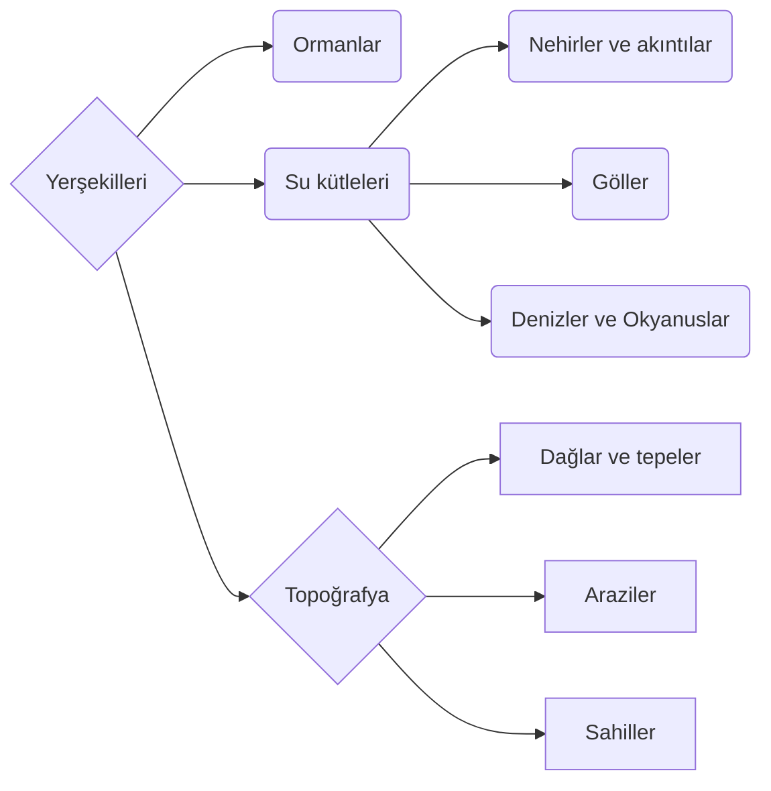

# Bölüm I: Yerşekilleri Aarthal evreni için neyi ifade eder?
> **Yeryüzü şekli**, Dünya'nın veya diğer gezegen cisimlerinin katı yüzeyinin doğal veya yapay bir özelliğidir. Yeryüzü şekilleri birlikte belirli bir araziyi oluşturur ve arazideki düzenlemeleri topografya olarak bilinir. Yer şekilleri arasında tepeler, dağlar, ovalar, yaylalar, kanyonlar ve vadilerin yanı sıra okyanus ortası sırtları, yanardağlar ve büyük okyanus havzaları gibi batık özellikler dahil olmak üzere körfezler, yarımadalar ve denizler gibi kıyı çizgisi özellikleri bulunur.
> <small>-Vikipedi(Yeryüzü şekli)</small>

**Yerşekilleri**, kişilerin ayak bastığı coğrafyayı daha iyi tanımlayabilmemizi sağlar. Bir Kehrunit'in üzerinde gezdiği çöl ile bir cücenin içinde mutlu mesut yaşadığı dağı arasında devasa farklar varken, bunları ayırabilmemiz, ve ararken daha kolay bir şekilde ulaşabilmemiz gereklidir. Bu sebepten dolayı, gerçek hayatta olduğu kadar detaylı bir şekilde olmasa da bir takım gerçekçi koşullar ve etkenler kullanarak Aarthal evreni içerisinde varolan yeryüzü şekillerini(veya yerşekilleri, nasıl kullanmak isterseniz) birbirinden ayırıp kategorileştireceğiz.

Yukarıda görüldüğü gibi yerşekilleri de kendi içerisinde pek çok farklı kategoriye bölünür.

# Bölüm II: Topoğrafya
**Topoğrafya** kategorisi, bir bölge içerisindeki bütün toprak şekillerini içinde barındırır. 

## A: Araziler
## Oorasha Deltası
**Oorasha Deltası**, [[COĞRAFYA 01 - Genel bilgiler; Süperkıtalar, Takımkıtalar, Kıtalar; Karaderinlik ve Bölgeler#Alghâri Düzlükleri|Alghâri Düzlükleri]] içerisinde kalan nehirler birliğinin havasıdır. Çevresini oldukça tarıma elverişli bir alan haline getirir.

## B: Sahiller
## Safir Sahil
**Safir Sahil**, Doronsûn bölgesinin kuzey ve batı sahilleridir. Sahil şeridi parlak yeşillikler ile kaplı olması nedeniyle elfler tarafından bu isim doğru görülmüştür.

## C: Dağlar ve tepeler

# Bölüm III: Ormanlar
İsminden de anlaşılacağı gibi bu kategori içerisinde orman, koru ve önemli sayılabilecek ağaçlık alanları içerisinde barındırır.

## Teim Ormanı
**Teim Ormanı**(okunuşu: / teɪm / ), Lathia bölgesinde bulunur. Kuzeyinde Lath liman şehri, güneyinde Gywin bulunur. Ormanda irili ufaklı bir çok türden ağaç ve bitki bulunur. Batı Aarthal bölgesinde hatrı sayılır tahta ekipmanlar ve mobilyaların ahşapı buradan çıkıp, genellikle Lath şehrinde üretildiğinden ünlü bir ormandır. Yerleşkenin tam ortasında devasa bir Doerner ağacı bulunmaktadır, ve bu ağaç, druidler tarafından kutsal sayılmaktadır.

## Kanayan Ormanlar
**Kanayan Ormanlar**, Batı Aarthal'ın kuzey sınırında, Kuzey Aarthal'ın güneyinde kalan büyük bir ormandır. Dörtlü Taç Kavgası sırasında gizemli büyüler nedeniyle birtakım değişiklikler geçirmiş, yaşanamayacak bir yere dönüşmüştür.

Korkunç yaratıkların ve mistik anomalilerin oluşumları ile Batı halkı tarafından masallarda anlatılır.

# Bölüm IV: Su kütleleri
**Su kütleleri**, bölgeler içinde veya arasında bulunan herhangi büyük sulu alanlara denir. Bunlar küçük su birikintileri değildir, ancak devasa olmak da zorunda değildir. Üç farklı alt kategorisi vardır.

## A: Nehirler ve diğer akıntılar
### Edwin Nehri
Edwin nehri, Gylfindor bölgesinin tam merkezinden doğuya doğru akan bir nehirdir. etrafında çoğunlukla Gylfialılar yaşar. Arbor, Hjarik, ve Barad'Zul gibi pek çok şehir ve köy bu nehrin etrafında sıralanmıştır.

### Safir Nehri
Safir nehri, Nimfain ile Merdehêl arasından akan kısa bir nehirdir.

## B: Denizler ve okyanuslar
### Elf Denizi
Elf Denizi, Batı Aarthal'ın kuzey ve doğu sahillerine, Lórindol'ün ise güney sahillerine denk gelen su kütlesidir. Elf Denizi tanımı ise bu körfezin elflerin Aarthal'daki anayurdu olmasından gelir.

### Sonsuz Deniz
Sonsuz Deniz Batı Aarthal'ın trafiği en çok denizidir. Batısında Alghâri Düzlükleri, Ghaskeena, doğusunda gylfindor ve Kehram Çölü, güneyinde ise Lathia ve Özgür Ülke sahilleri bulunur.

Deniz, pek çok medenyiet için önemli bir ticaret yoludur. Sadece Arbor Krallığı donanmasının 15.000 adet gemisi, bu deniz üserinde bulunur.

## C: Göller ve diğer orta büyüklükteki su kütleleri
### Safir göl
Safir Göl, Batı Aarthal ile Kuzey Aarthal arasında yer alan bir göldür. İki ormanın arasında kalması sebebiyle ışık bu gölü çoğunlukla yeşilimsi bir renkte gösterir. Batı sahillerinde Eeron kenti bulunur, doğu sahilleri ise Kanayan Ormanlar'a bakar.